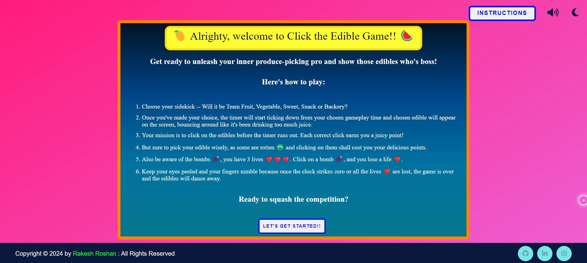
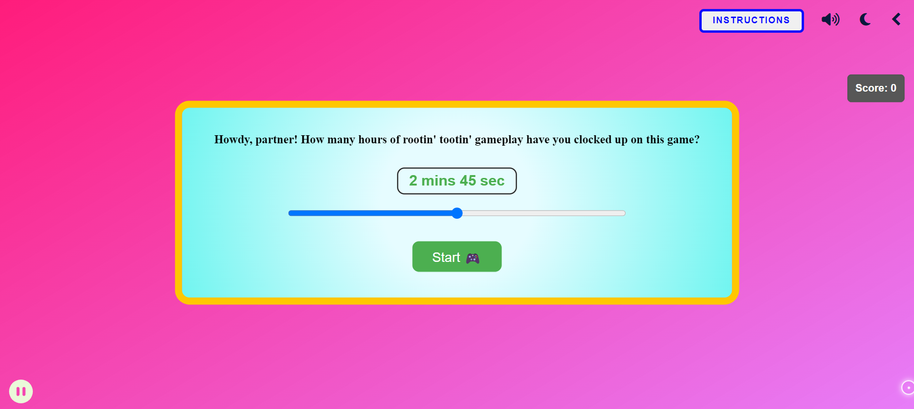
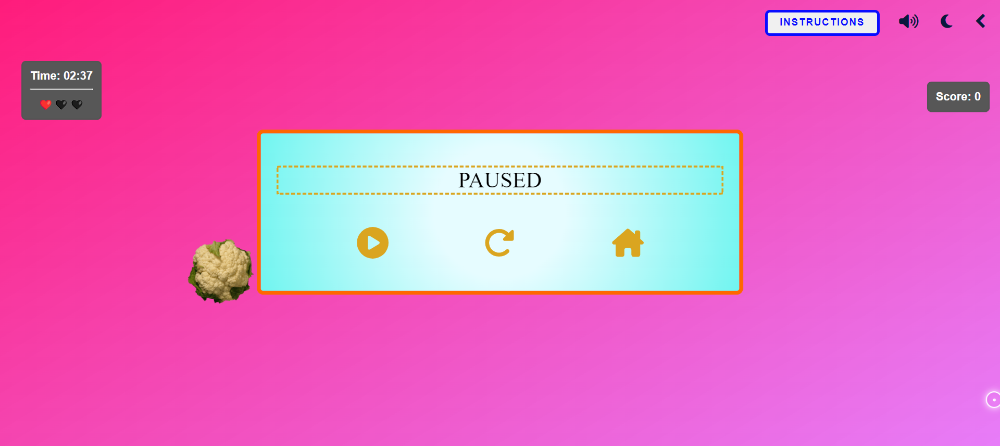
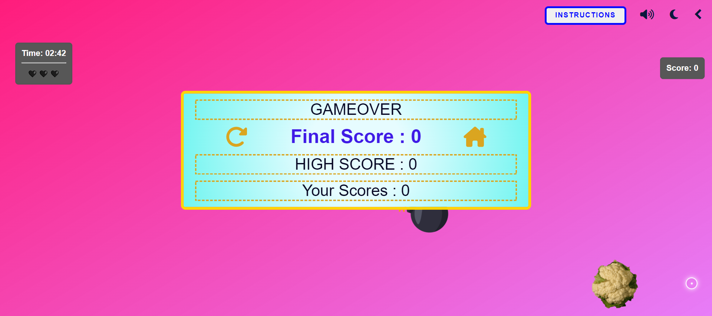

# <p align="center">✨Click-The-Edible-Game✨</p>
<!-------------------------------------------------------------------------------------------------------------------------------------->
 <div align="center">
 <p>

[](https://github.com/ellerbrock/open-source-badges/)


 </p>
 </div>

<!-- --------------------------------------------------------------------------------------------------------------------------------------------------------- -->

<div id="top"></div>

<h2>Table of Contents🧾</h2>

- [Introduction📌](#introduction)
- [Technology Used🚀](#technology-used)
- [Overview⭐](#overview)
- [Getting Started💥](#getting-started)
- [Contributing Guidelines📑](#contributing-guidelines)
- [Code Of Conduct📑](#code-of-conduct)
- [Project Admin⚡](#project-admin)
- [Contributing is fun🧡](#contributing-is-fun)
<br>

<!-- --------------------------------------------------------------------------------------------------------------------------------------------------------- -->

<h2>Introduction📌</h2>

A well-designed interesting game made using HTML, CSS, and JS where you can play with your favorite edible and click on it to get the highest score.

- There are five categories - Fruits, Vegetables, Sweets, Snacks, and Bakery Products. Click on your favorite edible to start the game.
- You can choose how much time you want to spend on one edible.
- Timer, Score and Lives ❤️ count are shown on the screen.
- Clicking on one edible will increase your score by 1.
- Clicking on a rotten 🤢 edible will decrease the score by 1.
- Clicking on a bomb 💣 will decrease your lives count by 1.
- When the time is over or all of your `3` lives are exhausted, it's game over, and the final score will be shown.
- All the scores are stored until you remain on the game i.e, before you refresh/reload/close the page.
- High Score, along with all the scores are shown sorted in descending order.
- You can either click on the refresh button or return to home to select a new edible.

<!-- --------------------------------------------------------------------------------------------------------------------------------------------------------- -->

<h2>Technology Used🚀</h2>

<p>
  <a href="https://www.w3schools.com/html/"> </a>
  <a href="https://www.w3schools.com/css/"> </a>
  <a href="https://www.w3schools.com/js/"></a>
</p>
<p align="right">(<a href="#top">back to top</a>)</p>

<!-- --------------------------------------------------------------------------------------------------------------------------------------------------------- -->

<h2>Overview⭐</h2>

<h2>Live Project -- (https://click-the-edible-game.netlify.app/)</h2>

<h3>Landing Page :-</h3>

<br><br>
<h3>Home/Main Page :-</h3>

<br><br>
<h3>Instructions Box :-</h3>

<br><br>
<h3>Selection of Edible Page :-</h3>


<br><br>
<h3>Choose GamePlay Time Box :-</h3>

<br><br>
<h3>Playing Screen :-</h3>

<br><br>
<h3>Dark Mode :-</h3>

<br><br>
<h3>Rotten Edibles :-</h3>

<br><br>
<h3>Play/Pause/Restart Box :-</h3>

<br><br>
<h3>High Score/Your Scores Box :-</h3>

<br>
<p align="right">(<a href="#top">back to top</a>)</p>


<!-- --------------------------------------------------------------------------------------------------------------------------------------------------------- -->
<h2>Local installation video </h2> -> 
https://github.com/rahat2134/Click-The-Edible-Game/assets/136263179/5f426bc2-1877-4eb7-8e90-173e061d8d32


<h2>Getting Started💥</h2>

- Fork this Repository.
- Clone the forked repository in your local system.
```
git clone https://github.com/<your-github-username>/Click-The-Edible-Game.git
```
- Open `index.html` in your browser.
- View the [Live Project](https://click-the-edible-game.netlify.app/) here.
- Raise an issue if you find a bug or add a feature.
- Wait for the issue to be assigned and proceed only after the issue is assigned to you.
- Navigate to the project directory.
```
cd Click-The-Edible-Game
```
- Create a new branch for your feature.
```
git checkout -b <your_branch_name>
```
- Perfom your desired changes to the code base.
- Track and stage your changes.
```
# Track the changes
git status

# Add changes to Index
git add .
```
- Commit your changes.
```
git commit -m "your_commit_message"
```
- Push your committed changes to the remote repo.
```
git push origin <your_branch_name>
```
- Go to your forked repository on GitHub and click on `Compare & pull request`.
- Add an appropriate title and description to your pull request explaining your changes and efforts done.
- Click on `Create pull request`.
- Congrats! 🥳 You've made your first pull request to this project repo.
- Wait for your pull request to be reviewed and if required suggestions would be provided to improve it.
- Celebrate 🥳 your success after your pull request is merged successfully.
<p align="right">(<a href="#top">back to top</a>)</p>

<!-- --------------------------------------------------------------------------------------------------------------------------------------------------------- -->

<h2>Contributing Guidelines📑</h2>

Read our [Contributing Guidelines](https://github.com/Rakesh9100/Click-The-Edible-Game/blob/main/.github/CONTRIBUTING_GUIDELINES.md) to learn about our development process, how to propose bugfixes and improvements, and how to build to Click-The-Edible-Game.

<!-- --------------------------------------------------------------------------------------------------------------------------------------------------------- -->

<h2>Code Of Conduct📑</h2>

This project and everyone participating in it is governed by the [Code of Conduct](https://github.com/Rakesh9100/Click-The-Edible-Game/blob/main/.github/CODE_OF_CONDUCT.md). By participating, you are expected to uphold this code.

<!-- --------------------------------------------------------------------------------------------------------------------------------------------------------- -->

<h2>This repo has been part of the following Open Source Programs🥳</h2>

<table>
<tr>
<td align="center">
<a href="https://iwoc.codes/"></a><br><sub><b>IWOC 2k24</b></sub>
</td>
<td align="center">
<a href="https://www.jwoc.tech/"></a><br><sub><b>JWOC 2k24</b></sub>
</td>
<td align="center">
<a href="https://www.socialwinterofcode.com/"></a><br><sub><b>SWOC 2k24</b></sub>
</td>
<td align="center">
<a href="https://dsc-slop.github.io/"></a><br><sub><b>SLOP 2k23</b></sub>
</td>
<td align="center">
<a href="https://jwoc.tech/"></a><br><sub><b>JWOC 2k23</b></sub>
</td>
<td align="center">
<a href="https://hacktoberfest.com/"></a><br><sub><b>Hacktoberfest 2k22</b></sub>
</td>
</tr>
</table>
<p align="right">(<a href="#top">back to top</a>)</p>

<!-- --------------------------------------------------------------------------------------------------------------------------------------------------------- -->

<h2>Project Admin⚡</h2>

<table>
<tr>
<td align="center">
<a href="https://github.com/Rakesh9100/"></a><br><sub><b>Rakesh Roshan</b></sub>
</td>
</tr>
</table>

<!-- --------------------------------------------------------------------------------------------------------------------------------------------------------- -->

<h2>Project Contributors🫂</h2>

<a href="https://github.com/rakesh9100/click-the-edible-game/graphs/contributors">
  
</a>

<!-- --------------------------------------------------------------------------------------------------------------------------------------------------------- -->

<h2>Contributing is fun🧡</h2>

[](https://forthebadge.com)
<h3>Contributions of any kind from anyone are always welcome🌟!!</h3>
<h3>Give it a 🌟 if you ❤ this project. Happy Coding👨‍💻</h3>
<p align="right">(<a href="#top">back to top</a>)</p>
